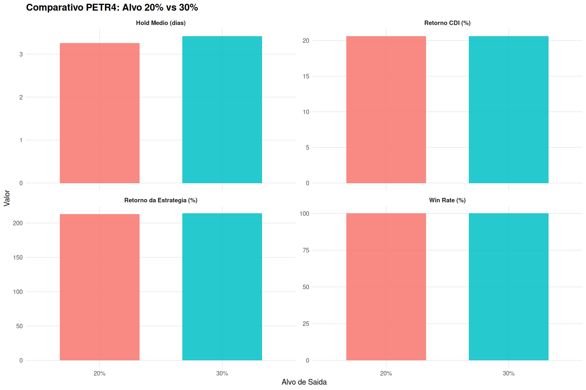
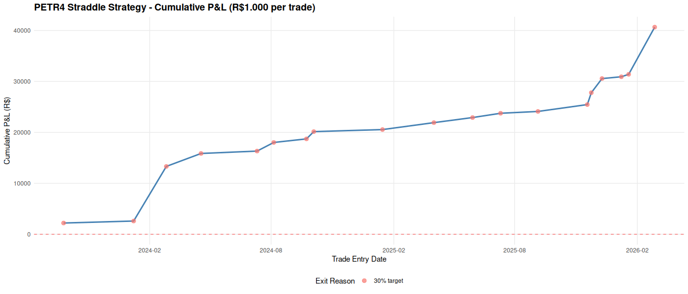

# Objective

This report follows the same narrative style used in the Tsallis reports and answers three practical questions:

1. Can low-volatility events in PETR4 be used as a robust straddle alert?
2. How does the strategy perform with **20%** vs **30%** take-profit targets?
3. Is total return superior to a CDI benchmark over the same period?

All simulations use **R$ 1,000 per alert**, ATM straddle pricing, and only entries with **at least 15 days to expiry**.

---

# Strategy Logic (Code Explained in the Body)

## Step 1: Compute rolling volatility

We use a 20-day rolling standard deviation of log returns:

$$
\sigma_t = SD\left(\ln\left(\frac{P_t}{P_{t-1}}\right),\, 20\text{-day window}\right)
$$

Core implementation:

```r
# log returns
log_returns <- diff(log(close_prices), lag = 1)

# rolling volatility (20 days)
rolling_vol <- calc_rolling_vol(returns, window = 20)
```

## Step 2: Generate alert signal

The alert is fired when volatility crosses below its 30th percentile:

```r
vol_threshold <- quantile(petr4_vol$volatility, 0.30, na.rm = TRUE)

is_alert <- (!is.na(prev_vol) & prev_vol > vol_threshold & volatility <= vol_threshold)
```

Interpretation:

- We are not buying straddles on every low-vol day.
- We buy specifically on the **crossing event**, which marks the transition into a compressed-vol regime.

## Step 3: Build straddle and mark-to-market daily

Each alert creates an ATM straddle priced via Black-Scholes:

```r
cost <- straddle_price(alert_price, strike_atm, T, r_annual, alert_vol)
```

Then we reprice the same structure each day until exit or expiry:

```r
straddle_value <- Call_BS(S_t, K, T_remaining, r, sigma_t) + Put_BS(S_t, K, T_remaining, r, sigma_t)
pnl_pct <- (straddle_value - cost) / cost * 100
```

## Step 4: Exit rule

Two tested variants:

- Variant A: exit at first hit of **+20%** or expiry
- Variant B: exit at first hit of **+30%** or expiry

---

# Volatility Regime Evidence


The visual pattern used by the strategy is visible in PETR4:

- volatility compresses,
- then tends to re-expand,
- which helps reprice long-vol positions (straddles).

---

# Main Performance Results

## Side-by-side comparison (same period)

| Target | Trades | Capital | Net P&L | Return | Win Rate | Avg Hold | CDI Return | Excess vs CDI | Outperformance |
|--------|--------|---------|---------|--------|----------|----------|------------|---------------|----------------|
| 20% | 19 | R$ 19,000 | R$ 40,540.83 | 213.37% | 100.0% | 3.26 days | 20.62% | R$ 36,623.65 | 10.35x |
| 30% | 19 | R$ 19,000 | R$ 40,662.04 | 214.01% | 100.0% | 3.42 days | 20.62% | R$ 36,744.86 | 10.38x |

Data source: `target_comparison_20_vs_30.csv`.

Interpretation:

- 30% target produced slightly higher total return (+0.64 pp).
- 30% target also increased average holding time (+0.16 day).
- Both configurations strongly outperformed CDI over the same calendar window.

---

# Visualization of 20% vs 30%



This chart confirms the table findings:

- Return improvement from 20% to 30% is small,
- but still positive,
- with only a minor increase in holding time.

---

# Equity Curve View

## Baseline 20% target


## Alternative 30% target



Both curves are strongly upward in this historical sample.

---

# Why the Model Can Work (and Why It Can Fail)

## Why it works in this sample

1. Entries occur when option premium is relatively cheap (compressed vol state).
2. Subsequent vol expansion reprices both legs favorably.
3. Fast exits avoid excessive theta decay in many trades.

## Key caveats

1. Mark-to-model pricing (Black-Scholes proxy) is not equal to tradable midpoint in all sessions.
2. Real execution includes spread/slippage/fees/taxes.
3. Live implied vol can diverge from historical vol proxy.
4. Regime behavior can change; no guarantee future behavior matches 2023-2026.

---

# Recommendation

If the objective is maximum raw return in this backtest, **30% target** wins marginally.
If the objective is slightly faster turnover with nearly identical total return, **20% target** is also valid.

Practical decision rule:

- Use 30% if you accept a little more time in market for a small return gain.
- Use 20% if you prioritize speed and operational simplicity.

---

# Reproducibility

Main scripts used:

- `straddle_simulation_v2.R` (20% target)
- `straddle_simulation_30pct_petr4.R` (30% target)
- `compare_straddle_targets_20_vs_30.R` (comparison table/plot)

Main outputs used by this report:

- `target_comparison_20_vs_30.csv`
- `target_comparison_20_vs_30.png`
- `petr4_straddle_equity_curve.png`
- `petr4_straddle_equity_curve_30pct.png`
- `volatility_rolling_by_symbol.png`
