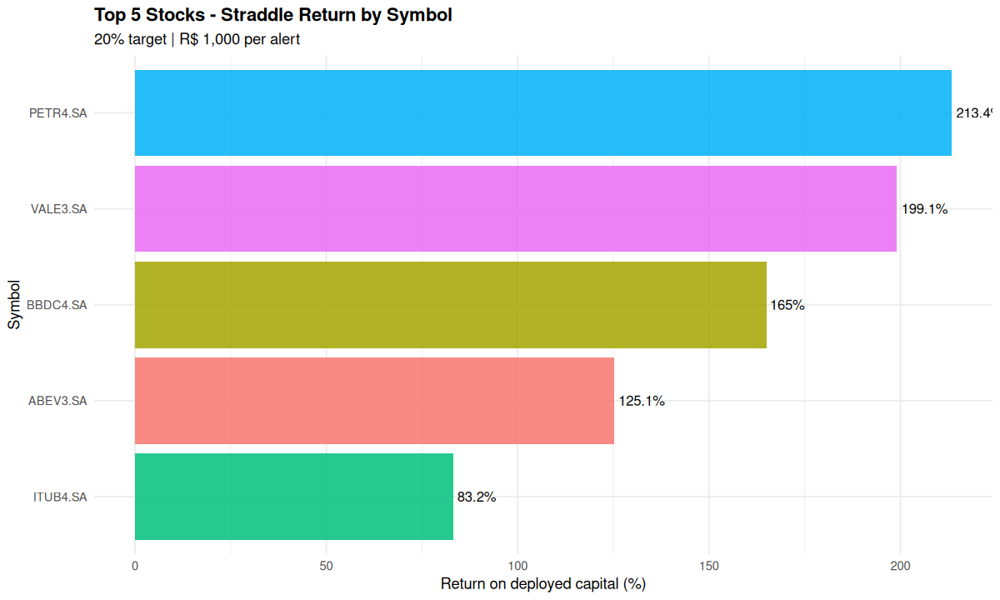
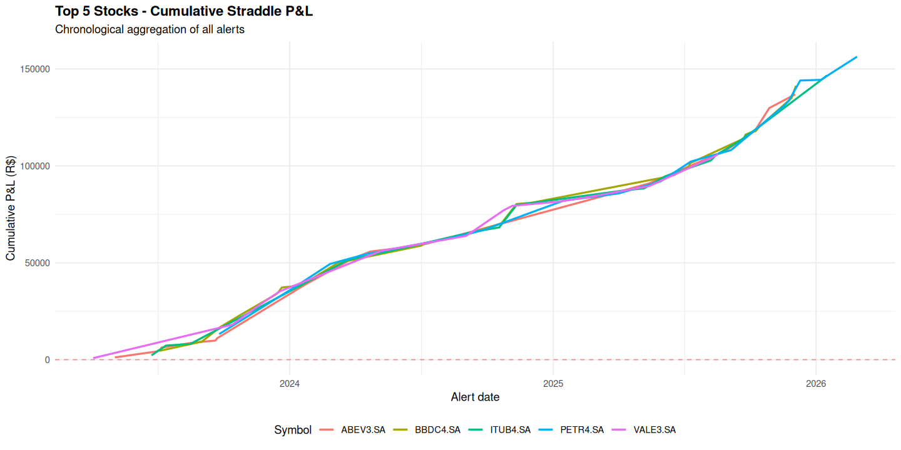

# Objetivo

Este estudo expande o teste de straddle antes aplicado apenas em PETR4 para as **cinco ações mais relevantes** usadas neste projeto:

- PETR4.SA
- VALE3.SA
- ITUB4.SA
- BBDC4.SA
- ABEV3.SA

O objetivo é verificar se a mesma lógica de **alerta por baixa volatilidade** continua funcionando de forma consistente em um conjunto mais amplo de ações líquidas da bolsa brasileira, além de comparar o retorno consolidado com o **CDI**.

---

# Definição da Estratégia

A lógica usada no estudo isolado de PETR4 foi mantida sem mudanças.

## Sinal

Para cada ação, calculamos uma volatilidade rolling de 20 dias a partir dos retornos logarítmicos:

$$
\sigma_t = SD\left(\ln\left(\frac{P_t}{P_{t-1}}\right), 20\right)
$$

O alerta é disparado quando a volatilidade cruza para baixo o percentil 30 da distribuição histórica daquela própria ação:

```r
vol_threshold <- quantile(vol_df$volatility, 0.30, na.rm = TRUE)

is_alert <- !is.na(prev_vol) & prev_vol > vol_threshold & volatility <= vol_threshold
```

Isso é importante: o alerta é **específico para cada papel**, e não um limiar único aplicado a todos.

## Instrumento e precificação

Em cada alerta, o script monta um **straddle ATM** com o próximo vencimento mensal, desde que a opção ainda tenha pelo menos 15 dias restantes:

```r
strike <- round(alert_price, 2)
cost <- straddle_price(alert_price, strike, T, r_annual, alert_vol)
```

A estrutura é remarcada diariamente com Black-Scholes:

```r
straddle_value <- Call_BS(S_t, K, T_remaining, r, sigma_t) + Put_BS(S_t, K, T_remaining, r, sigma_t)
pnl_pct <- pnl / cost * 100
```

## Regra de saída

O estudo multiativo usa a mesma regra base do estudo de PETR4:

- saída no **alvo de +20%**, ou
- carregamento até o vencimento caso o alvo não seja atingido.

Cada alerta recebe **R$ 1.000**.

---

# Por que esta versão com 5 ações importa

O resultado de uma única ação poderia ser apenas uma anomalia específica da PETR4. A expansão para as 5 maiores ações testa se a mesma estrutura sobrevive em setores diferentes:

- petróleo e energia via PETR4,
- mineração via VALE3,
- bancos privados via ITUB4 e BBDC4,
- consumo defensivo via ABEV3.

Se o sinal continuar funcionando nesses papéis, a estratégia passa a ter mais credibilidade como uma **abordagem repetível de regime de volatilidade**, e não apenas como um caso isolado.

---

# Resultado no nível de portfólio

| Métrica | Valor |
|--------|-------|
| Ações usadas | 5 |
| Total de operações | 101 |
| Capital alocado | R$ 101.000 |
| Lucro líquido | R$ 156.361,30 |
| Retorno sobre capital alocado | 154,81% |
| Hold médio | 2,92 dias |
| Taxa de acerto | 100,0% |
| Lucro equivalente do CDI no mesmo período | R$ 25.401,99 |
| Retorno do CDI | 25,15% |
| Excesso sobre o CDI | R$ 130.959,31 |
| Outperformance vs CDI | 6,16x |

Fonte: `top5_straddle_portfolio_summary.csv`.

Interpretação:

- A estratégia continua fortemente lucrativa ao sair de 1 ação para 5.
- O retorno cai em relação à PETR4 isolada, o que é esperado, pois a diversificação adiciona nomes mais fracos.
- Ainda assim, o resultado segue muito superior ao CDI.

---

# Ranking por ação

| Posição | Papel | Alertas | Trades | Retorno | Lucro líquido | Hold médio | Outperformance vs CDI |
|------|--------|--------|--------|--------|---------|----------|------------------------|
| 1 | PETR4.SA | 20 | 19 | 213,37% | R$ 40.540,83 | 3,26 dias | 10,35x |
| 2 | VALE3.SA | 13 | 13 | 199,08% | R$ 25.879,93 | 2,23 dias | 9,87x |
| 3 | BBDC4.SA | 29 | 29 | 165,02% | R$ 47.854,38 | 2,90 dias | 8,04x |
| 4 | ABEV3.SA | 23 | 21 | 125,14% | R$ 26.279,83 | 2,62 dias | 5,66x |
| 5 | ITUB4.SA | 21 | 19 | 83,19% | R$ 15.806,32 | 3,42 dias | 3,79x |

Esse ranking mostra duas formas diferentes de liderança:

- **Melhor retorno percentual:** PETR4
- **Maior lucro absoluto:** BBDC4, por ter gerado mais operações válidas

---

# Retorno por ação



A dispersão entre os papéis é ampla.

Leitura principal:

- PETR4 e VALE3 são os nomes mais fortes em retorno percentual.
- BBDC4 fica abaixo delas em retorno percentual, mas o volume de alertas faz dela a maior geradora de lucro em reais.
- ITUB4 é o papel mais fraco do grupo, embora ainda supere o CDI com folga.

---

# Curva de equity cronológica



Esse gráfico ajuda a responder se o portfólio depende apenas de um único cluster de operações.

A resposta é não.

A curva sobe em múltiplos períodos e com contribuições de vários papéis, o que é mais saudável do que um portfólio dominado por um único surto de ganhos.

---

# Como o código multiativo funciona

O script é uma generalização direta da versão usada em PETR4.

## Passo 1: iterar pela lista de ações

```r
symbols <- c("PETR4.SA", "VALE3.SA", "ITUB4.SA", "BBDC4.SA", "ABEV3.SA")
results <- lapply(symbols, simulate_symbol)
```

Cada papel recebe sua própria série de volatilidade e seu próprio fluxo de alertas.

## Passo 2: construir a base de volatilidade por ação

```r
build_volatility_frame <- function(symbol) {
  xts_data <- getSymbols(symbol, from = start_date, to = end_date, auto.assign = FALSE)
  close_prices <- Cl(xts_data)
  log_returns <- diff(log(close_prices), lag = 1)
  ...
}
```

Isso evita misturar distribuições entre ações que naturalmente têm níveis de volatilidade diferentes.

## Passo 3: simular trades de forma independente

```r
simulate_symbol <- function(symbol) {
  vol_threshold <- quantile(vol_df$volatility, 0.30, na.rm = TRUE)
  ...
  exit_hit <- position_data %>% filter(pnl_pct >= target_pct) %>% slice(1)
}
```

Cada ação é avaliada com seus próprios alertas, entradas, saídas e fluxo de P&L.

## Passo 4: consolidar resultados do portfólio

```r
summary_by_symbol <- bind_rows(lapply(results, function(x) x$summary))
trades_by_symbol <- bind_rows(lapply(results, function(x) x$trades))
portfolio_pnl <- sum(summary_by_symbol$total_pnl, na.rm = TRUE)
```

Isso entrega ao mesmo tempo:

- estatísticas por ação,
- e o resultado consolidado do portfólio.

---

# Interpretação por papel

## PETR4.SA

Continua sendo o melhor papel em retorno percentual. Isso reforça que o resultado original não foi um acaso causado por algum artefato de código.

## VALE3.SA

Teve desempenho muito forte com menos trades. Isso sugere um sinal mais seletivo, porém eficiente, para o caso da mineração.

## BBDC4.SA

Foi o papel mais produtivo em lucro absoluto. O sinal disparou com frequência e manteve boa qualidade.

## ABEV3.SA

É um caso intermediário: menor volatilidade natural que os líderes, mas ainda com um padrão forte de expansão após compressão.

## ITUB4.SA

Foi o papel mais fraco do grupo. Isso não invalida a ação, mas sugere que a compressão de volatilidade aqui é menos explosiva do que em PETR4 ou VALE3.

---

# Comparação contra o CDI

Essa é a pergunta principal de alocação.

Usando o mesmo intervalo geral do estudo, o portfólio de straddles nas 5 ações retornou:

- **Estratégia:** 154,81%
- **CDI:** 25,15%

Logo:

$$
\text{Outperformance} = \frac{156.361,30}{25.401,99} \approx 6,16x
$$

Ou seja, mesmo após sair do melhor papel isolado para um universo diversificado de 5 ações, a estratégia segue muito superior ao benchmark de renda fixa.

---

# Limitações

| Fator | Observação |
|--------|-------|
| Modelo de precificação | Black-Scholes com proxy de volatilidade histórica, não com midpoint real da opção |
| Slippage e spread | Não descontados explicitamente |
| Impostos | Não incluídos |
| Taxa de acerto de 100% | Muito provavelmente otimista por usar mark-to-model |
| Estabilidade futura | A persistência histórica do regime pode enfraquecer fora da amostra |

A interpretação correta não é que isso representa um sistema garantido de 100% de acerto. A interpretação correta é que o **sinal foi forte o suficiente in-sample** para justificar testes adicionais de robustez.

---

# Recomendação

A expansão para cinco ações aumenta a confiança na abordagem.

Se o próximo objetivo for qualidade de pesquisa, e não apenas performance bruta de backtest, os próximos passos naturais são:

1. introduzir spreads, taxas e custos realistas,
2. comparar 20% vs 30% alvo papel por papel,
3. testar se excluir nomes mais fracos, como ITUB4, melhora o portfólio,
4. gerar um relatório complementar com ranking de todos os 101 alertas por contribuição ao P&L.

Conclusão atual:

**A ideia de straddle por baixa volatilidade sobrevive à expansão de PETR4 para um universo diversificado de 5 ações e continua batendo o CDI com ampla margem.**

---

# Reprodutibilidade

Script principal:

- `multi_stock_straddle_study.R`

Principais saídas usadas neste relatório:

- `top5_straddle_summary_by_symbol.csv`
- `top5_straddle_portfolio_summary.csv`
- `top5_straddle_return_by_symbol.png`
- `top5_straddle_equity_curve.png`
